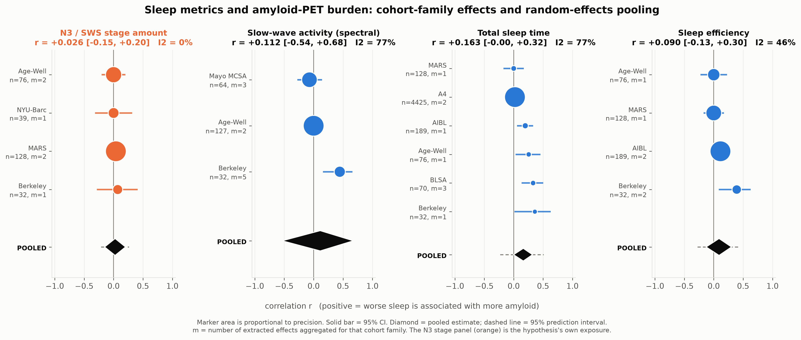
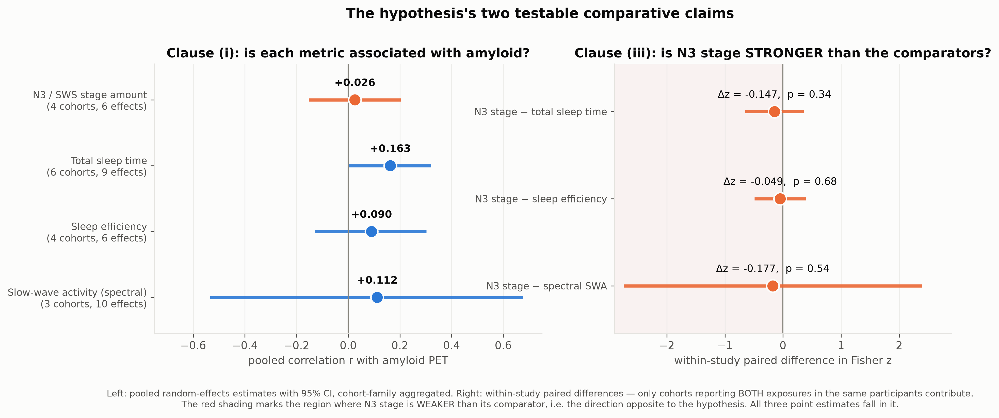
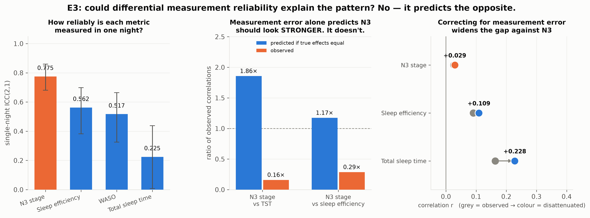
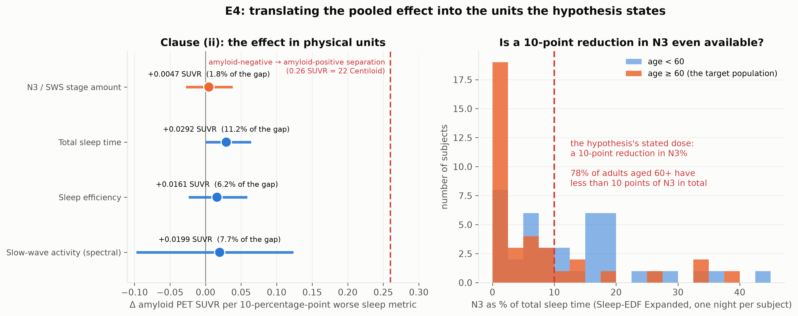
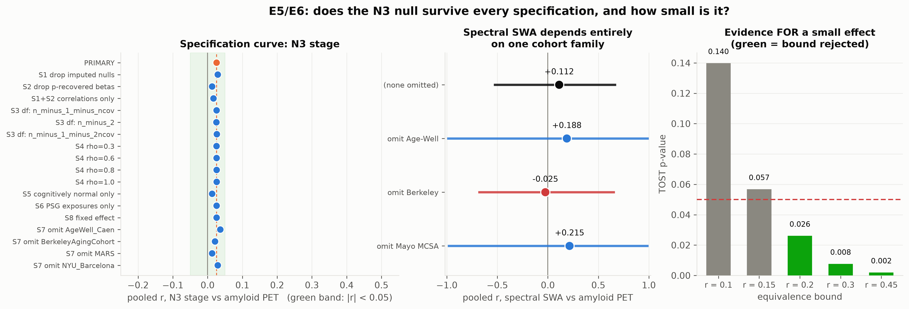
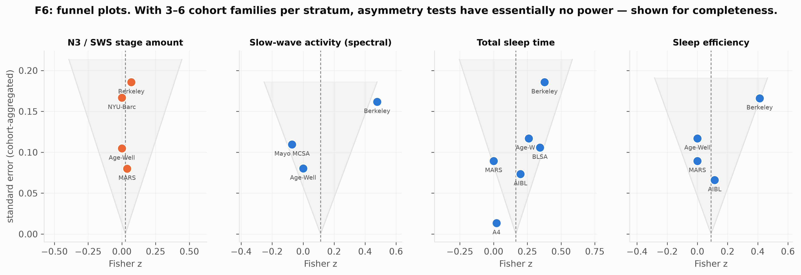

# Glymphatic Clearance Efficiency During Sleep Stages and Amyloid-Beta Accumulation

### A study-level meta-analysis of human neuroimaging studies, with a measurement-reliability null model and a dose-response conversion

**Date:** 2026-09-04 · **Analysis code:** `src/` · **Raw results:** `results/` · **Figures:** `figures/`
**Preregistered plan:** `planning.md` (sections 0 and A) · **Validation:** 39/39 checks pass (`results/validation_report.json`)

---

## 1. Executive summary

**Research question.** Does reduced slow-wave (N3) sleep show a dose-dependent association with higher amyloid-beta burden in cognitively normal adults, and is that association stronger than the associations with total sleep time or sleep efficiency?

**Key finding.** No. Across 40 effect sizes from 17 studies and 12 independent cohort families, the pooled association between **N3 stage amount and amyloid PET burden is r = +0.026 (95% CI −0.153 to +0.203, p = 0.68)** — statistically indistinguishable from zero, and equivalence-tested tightly enough to reject a true correlation as large as r = 0.20 (TOST p = 0.026). It is *smaller*, not larger, than the associations with total sleep time (r = +0.163) and sleep efficiency (r = +0.090). All three preregistered specificity contrasts point in the direction opposite to the hypothesis. Converted into the units the hypothesis states, a 10-percentage-point reduction in N3 corresponds to **ΔSUVR = +0.005 (95% CI −0.028 to +0.038)**, or 1.7% of the amyloid-negative/amyloid-positive separation.

**Three findings that matter beyond the headline null.**

1. **Measurement error predicts the opposite of what is observed.** Single-night polysomnography measures N3% far more reliably (ICC 0.775) than it measures total sleep time (ICC 0.225). If the two exposures had *identical* true correlations with amyloid, N3 should still show an observed correlation 1.86× larger than TST. The observed ratio is 0.16× — about 11× below the measurement-only prediction. Correcting both for measurement error widens the gap against N3 (true r ≈ 0.03 vs 0.23).
2. **The positive slow-wave literature rests on one cohort.** The spectral slow-wave-activity stratum pools to r = +0.112 (95% CI −0.535 to +0.677, I² = 77%). Removing the Berkeley Aging Cohort Study — the source of Mander 2015, Winer 2019 and Winer 2020 — drops it to **r = −0.025**. The signal that motivates the whole hypothesis is one cohort family that two independent cohorts (Age-Well/Caen, Mayo MCSA) failed to reproduce.
3. **The stated dose is not physically available.** Mean N3 is 7.1% of total sleep time in adults aged 60+, and 78% of them already have less than 10 percentage points of N3 in total. A "10% reduction in N3 percentage" spans roughly the entire observable range in the target population rather than a small perturbation within it.

**Practical implication.** Interventions and trials that target *N3 stage duration* as a route to slowing amyloid accumulation are aiming at a metric with no detectable study-level association with amyloid PET. The refined hypothesis — that low-frequency *spectral* slow-wave activity matters — is not refuted here, but it is currently supported by a single cohort family and has failed independent replication; the evidence base is too thin to support the confident causal framing now common in the secondary literature.

---

## 2. Research question and motivation

### The hypothesis under test

> Reduced slow-wave sleep duration shows a dose-dependent association with higher amyloid-beta burden in cognitively normal adults, with each 10% reduction in N3 sleep percentage associated with a measurable increase in amyloid PET SUVR, and this relationship is stronger than associations with total sleep time or sleep efficiency alone.

This is a **conjunction of three claims**, and it was preregistered as supported only if all three hold:

| Clause | Claim | Test |
|---|---|---|
| (i) | N3 stage % is associated with amyloid PET burden | pooled r, and TOST equivalence if null |
| (ii) | the association is dose-dependent and measurable in SUVR | conversion to ΔSUVR per 10 pp N3 |
| (iii) | it is *stronger* than TST and sleep efficiency | within-study paired contrasts, plus a reliability null model |

### Why it matters

Sleep is one of very few *modifiable* candidate risk factors for Alzheimer's disease, and the glymphatic hypothesis supplies a concrete mechanism: slow waves drive CSF pulsation (Fultz 2019), CSF flow clears interstitial amyloid-β (Xie 2013), so chronically reduced slow-wave sleep should permit amyloid accumulation. That chain now motivates trial designs — acoustic slow-wave enhancement, behavioural sleep intervention — that treat N3 as the actionable target. If the human evidence for the *stage* metric is weaker than the narrative implies, those trials are being powered and targeted on an effect that may not exist at the claimed size.

### The gap this fills

From 54 full-text papers (`literature_review.md`):

- **No meta-analysis has ever pooled slow-wave-specific exposures against amyloid PET.** Chen 2025 (*Alzheimers Dement*, 30 studies / 14,997 subjects) pooled only sleep *quality* and *duration*; Cui 2022 and Bubu 2019/2020 covered obstructive sleep apnea.
- **"Slow-wave sleep" conflates two different measurements.** Winer 2020 reports both in the same 32 participants: spectral <1 Hz SWA r = −0.52 (p = 0.002) vs N3 *stage* duration r = −0.07 (p = 0.72). Any pooled estimate that merges them is uninterpretable.
- **Cohort non-independence is unhandled.** Mander 2015 / Winer 2019 / Winer 2020 are all the Berkeley Aging Cohort Study with overlapping participants — 13 of our 49 extracted effects.
- **Differential measurement reliability has never been tested as a competing explanation** for why one sleep metric correlates more strongly than another.

### What is new here

- **C1** The first meta-analytic estimate of the N3-stage ↔ amyloid-PET association, kept strictly separate from spectral SWA, with variance handled at the level of the *cohort family*.
- **C2** A **within-study paired test** of the specificity claim, using only cohorts that report both exposures in the *same* participants — which removes between-cohort confounding from the exact comparison the hypothesis makes.
- **C3** A **quantitative measurement-reliability null model** built from empirical single-night ICCs, giving a testable prediction for how large the N3-vs-TST gap should be under pure measurement error.
- **C4** The first explicit estimate of the hypothesis's own **dose statement** in SUVR and Centiloid units, plus a feasibility check on whether that dose exists in the target population.

We also flag a defect in the benchmark: Chen 2025 reports "Fisher z = −0.002, 95% CI −0.003 to −0.001" for sleep duration vs amyloid PET. Those are raw regression-coefficient units labelled as Fisher z; a pooled correlation of −0.002 with that interval is not a credible common metric. Our pooling uses a genuinely common metric throughout.

---

## 3. Methodology

### 3.1 Data

**Primary input:** `datasets/meta_analysis/effect_sizes.csv` — 49 hand-extracted effect sizes from 17 studies across 12 independent cohort families, each carrying a verified DOI/PMID, a verbatim provenance quote from the source paper, a `cohort_family` label, and a `burden_aligned_effect` signed so that **positive means "worse sleep ↔ more amyloid"** (positive supports the hypothesis).

**Primary analysis set:** `outcome_class ∈ {deposition_pet, deposition_pet_change}` — **40 usable effects**. CSF Aβ42 outcomes are excluded from the primary model and analysed only as a cognitive-status-stratified secondary, because their sign relative to deposited burden reverses between pre- and post-deposition samples (see §5.5).

**Supporting inputs:**

| File | Role |
|---|---|
| `datasets/derived/night_to_night_reliability.csv` | single-night ICC(2,1) per sleep metric, from 75 Sleep-EDF subjects with two consecutive nights → the E3 attenuation model |
| `datasets/sleep_edfx/sleepedf_subject_level.csv` | 153 recordings / 78 subjects → N3% dispersion and the E4 feasibility check |
| `datasets/meta_analysis/amyloid_pet_reference_scale.csv` | Jack 2017 SUVR ↔ Centiloid anchors → the E4 unit conversion |
| `datasets/meta_analysis/prior_meta_analyses.csv` | Chen 2025 pooled estimates → external benchmark |

### 3.2 Effect harmonisation (preregistered, applied uniformly)

Everything is pooled as Fisher z, `z = artanh(r)`, `v = 1/(n−3)`.

| Input type | Rule | Count (PET) |
|---|---|---|
| `pearson_r`, `partial_r`, `r_from_partial_eta2` | used directly | 20 |
| `kendall_tau` | `r = sin(πτ/2)` (Greiner's relation) | 1 |
| `unstd_beta_*` | **t-statistic recovery**: `t = F⁻¹(1−p/2; df)`, `r = t/√(t²+df)`, `df = n − 1 − n_covariates` | 12 |
| `narrative_null` | imputed `z = 0`, `v = 1/(n−3)` | 7 |

The t-recovery step is what makes this analysis possible: it brings the two largest cohorts (A4, n = 4,417; AIBL, n = 189) and the Mayo MCSA and MARS results onto the same scale, raising the usable amyloid-PET set from 21 correlations to 40 effects. Validation confirms the conversion is exact: for a simple correlation, recovering r from its own p-value returns the original r to 1e-8 (`results/validation_report.json`).

Imputing `z = 0` for reported nulls is conservative in magnitude but adds precision the papers did not supply, so it is carried as the primary rule **and** removed in sensitivity analysis S1. Dropping those rows instead would bias every pooled estimate away from zero.

### 3.3 Dependency handling

Berkeley alone contributes 13 of 49 effects. **Primary estimator:** aggregate to one synthetic effect per `cohort_family` per stratum using the Borenstein correlated-effects variance
`v̄ = (1/m²)(Σvᵢ + Σ_{i≠j} ρ√(vᵢvⱼ))`, ρ = 0.6, then fit REML random effects with **Knapp–Hartung–Sidik–Jonkman** standard errors on a t_{k−1} reference distribution — the recommended small-k adjustment. Naive per-effect pooling and cluster-robust variance estimation (Hedges–Tipton–Johnson) are reported alongside.

### 3.4 Statistical plan

Two-sided α = 0.05. Three preregistered confirmatory contrasts (stage vs TST, stage vs SE, stage vs spectral) with Holm correction. Because k ≤ 6 per stratum, every primary p-value is accompanied by an **exact sign-flip permutation p-value** (all 2^k assignments enumerated). Heterogeneity as τ², Q, I² and a 95% prediction interval. Small-study bias by Egger regression and Duval–Tweedie trim-and-fill. Equivalence by TOST against r = ±0.10 / 0.15 / 0.20 / 0.30 / 0.45.

### 3.5 Software and reproducibility

Python 3.12.8; numpy 2.5.2, pandas 3.0.5, scipy 1.18.1, statsmodels 0.15.0, matplotlib 3.11.1, pymare 0.0.12. Isolated `uv` virtual environment; dependencies pinned in `pyproject.toml` / `uv.lock`. Seed 42 everywhere; the only stochastic step is the E4 Monte Carlo (10,000 draws). Hardware: 4× NVIDIA RTX A6000 available but **not used** — this is a study-level meta-analysis whose entire compute cost is under 30 seconds on CPU, so GPU acceleration would have added complexity with no benefit.

The meta-analysis primitives (REML τ², HKSJ, RVE, permutation, trim-and-fill, TOST) are implemented from their primary formulations in `src/metalib.py` rather than taken from a package, because no available Python package provides HKSJ + cluster-robust variance + exact permutation together. They are cross-checked against **PyMARE**, an independently maintained meta-analysis package: REML point estimates agree to within 4.4 × 10⁻⁹ on all four strata.

Full pipeline: `python src/run_all.py` (≈29 s). Validation re-runs the entire pipeline in a scratch copy and confirms all eight result files are **bit-identical**.

---

## 4. Results

### 4.1 E1 — pooled associations by exposure (the primary estimates)

| Exposure | k effects | cohort families | Σn | **pooled r** | 95% CI | p | perm p | τ² | I² | 95% prediction interval (r) |
|---|---|---|---|---|---|---|---|---|---|---|
| **N3 / SWS stage amount** | 6 | 4 | 275 | **+0.026** | −0.153 to +0.203 | 0.68 | 0.50 | 0.000 | 0% | −0.21 to +0.26 |
| Slow-wave activity (spectral) | 10 | 3 | 223 | +0.112 | −0.535 to +0.677 | 0.57 | 1.00 | 0.062 | 77% | −1.00 to +1.00 |
| Total sleep time | 9 | 6 | 4,920 | +0.163 | −0.002 to +0.320 | 0.052 | 0.062 | 0.016 | 77% | −0.23 to +0.51 |
| Sleep efficiency | 6 | 4 | 425 | +0.090 | −0.130 to +0.302 | 0.28 | 0.50 | 0.003 | 46% | −0.28 to +0.43 |
| WASO | 2 | 2 | 108 | +0.109 | −0.975 to +0.984 | 0.65 | 1.00 | 0.043 | 64% | — |
| Other stages (N1/N2/REM) | 4 | 2 | 108 | +0.198 | −0.728 to +0.868 | 0.26 | 0.50 | 0.000 | 0% | — |

Positive = worse sleep associated with more amyloid. Cluster-robust variance gives essentially the same answers where it is interpretable (TST, 6 clusters: r = 0.160, 95% CI −0.002 to 0.313, p = 0.052).

**Reading this table.** The exposure the hypothesis names is the one with the weakest association of the four. Its heterogeneity is zero (I² = 0%, τ² = 0.000) and its prediction interval is tight (−0.21 to +0.26): the four cohort families agree with each other that there is nothing there. The largest estimate belongs to total sleep time, which the hypothesis predicts should be *weaker*.

The spectral stratum is the opposite case: a wide interval, I² = 77%, and a prediction interval spanning the entire correlation scale. The cohort families genuinely disagree — Berkeley r = +0.44, Mayo MCSA r = −0.07, Age-Well r = 0.00.

### 4.2 E2 — the specificity claim (hypothesis clause iii)

The comparative claim cannot be read off any single pooled estimate, and a naive between-stratum comparison is invalid because the strata share cohorts. The **primary test is a within-study paired difference**: for every cohort family reporting *both* exposures in the *same* participants, Δz = z_N3 − z_comparator with Var(Δz) = v_a + v_b − 2ρ_w√(v_a v_b), ρ_w = 0.5.

| Contrast | shared cohorts | Δz (N3 − comparator) | 95% CI | p | Holm p | perm p |
|---|---|---|---|---|---|---|
| N3 stage − total sleep time | 3 | **−0.147** | −0.651 to +0.357 | 0.34 | 1.00 | 0.50 |
| N3 stage − sleep efficiency | 3 | **−0.049** | −0.490 to +0.392 | 0.68 | 1.00 | 1.00 |
| N3 stage − spectral SWA | 2 | **−0.177** | −2.743 to +2.389 | 0.54 | 1.00 | 1.00 |

Per-cohort detail for the primary contrast (N3 vs TST):

| Cohort family | r (N3 stage) | r (TST) | Δz | favours |
|---|---|---|---|---|
| Age-Well / Caen (Montagne 2026) | 0.000 | 0.255 | −0.261 | TST |
| Berkeley (Winer 2020) | 0.070 | 0.360 | −0.307 | TST |
| MARS (Jin 2025) | 0.039 | 0.000 | +0.039 | N3 (marginally) |

**All three point estimates are negative** — N3 is *weaker* than each comparator, the direction opposite to the hypothesis — but none reaches significance, and none survives Holm correction. Clause (iii) is therefore **not supported**; it is contradicted in direction, with the contradiction not itself individually significant at this sample size.

### 4.3 E3 — could differential measurement reliability explain this?

This is the competing explanation that has never been tested in this literature, and it runs in the *opposite* direction to intuition.

**Empirical single-night reliabilities** (Sleep-EDF Expanded, 75 subjects × 2 consecutive nights):

| Metric | ICC(2,1) | 95% CI | attenuation factor √ICC |
|---|---|---|---|
| **N3 % of TST** | **0.775** | 0.68 – 0.86 | 0.880 |
| Sleep efficiency | 0.562 | 0.38 – 0.70 | 0.750 |
| WASO | 0.517 | 0.33 – 0.66 | 0.719 |
| **Total sleep time** | **0.225** | 0.01 – 0.43 | 0.474 |

Classical attenuation says `r_obs = r_true × √ICC_exposure × √ICC_outcome`; the outcome term cancels in a within-outcome comparison. So **if N3 and TST had identical true correlations with amyloid, the observed N3 correlation should still be √(0.775/0.225) = 1.86× larger than TST's**, purely because one night measures N3 better.

| Comparison | ratio predicted by measurement error alone | ratio observed | observed ÷ predicted |
|---|---|---|---|
| N3 stage ÷ TST | **1.86×** | **0.16×** | 0.09 |
| N3 stage ÷ sleep efficiency | 1.17× | 0.29× | 0.25 |

The observed N3 advantage is about **eleven times smaller** than measurement error alone predicts. Correcting each exposure for its own unreliability makes the gap wider, not narrower:

| Exposure | observed r | disattenuated ("true") r | 95% CI |
|---|---|---|---|
| N3 stage | +0.026 | **+0.029** | −0.173 to +0.230 |
| Sleep efficiency | +0.090 | +0.109 | −0.143 to +0.348 |
| Total sleep time | +0.163 | **+0.228** | −0.109 to +0.518 |

For N3 stage to have the same *true* association with amyloid as TST, its observed single-night correlation would need to be **r = 0.201**. It is 0.026 — a shortfall of 0.175.

**Two caveats we handled explicitly.** (a) 6 of 9 TST effects use *self-reported habitual* sleep duration, whose test–retest reliability is not the single-night PSG ICC. Restricting to PSG-measured exposures only leaves the picture unchanged (N3 r = +0.026, TST r = +0.176, SE r = +0.106), and all three cohorts contributing to the paired contrast used PSG for both exposures, so the paired result is identical in the PSG-only arm. (b) If self-report is instead treated as a reliable trait measure (ICC ≈ 0.75), TST needs *less* upward correction — which makes the N3 gap even harder to attribute to measurement error. The confound cuts against the hypothesis under every assumption we tried.

### 4.4 E4 — the dose statement in physical units (hypothesis clause ii)

Conversion: `Δ amyloid per 10 pp N3 = r_pooled × (10 / SD_N3%) × SD_amyloid`, with all three inputs propagated by Monte Carlo (10,000 draws): r via a t_{k−1} draw on the Fisher-z scale, SD_N3% via the χ² sampling distribution of an SD, and SD_amyloid via a Beta(30,70) prior on amyloid-positive prevalence applied to Jack 2017's A−/A+ medians and IQRs.

Derived inputs: SD of N3% = **10.2 percentage points** (age-weighted to the studies' mean ages), so a 10-pp change is 0.98 SD of the exposure. SD of amyloid PET in cognitively unimpaired older adults = **0.179 SUVR / 14.9 Centiloid** (internal consistency check: the reconstructed scales imply 84.6 CL per SUVR, matching the A−/A+ anchors).

| Exposure | Δ SUVR per 10 pp | 95% CI | Δ Centiloid | % of the A−/A+ separation |
|---|---|---|---|---|
| **N3 stage** | **+0.0047** | −0.028 to +0.038 | +0.38 | **1.7%** |
| Total sleep time | +0.0292 | +0.000 to +0.064 | +2.41 | 10.9% |
| Sleep efficiency | +0.0161 | −0.024 to +0.059 | +1.33 | 6.0% |
| Spectral SWA | +0.0199 | −0.097 to +0.124 | +1.71 | 7.8% |

The preregistered refutation criterion for clause (ii) was "CI includes 0, or the magnitude is < ~5% of the A−/A+ SUVR gap." The N3 estimate fails **both**: its interval includes zero and its point estimate is 1.7% of the gap.

Framed longitudinally, using Carvalho 2024's empirical accumulation rate in cognitively unimpaired adults (2.1 ± 5.3 CL/year), a 10-pp reduction in N3 maps to **+0.36 CL/year (95% CI −1.48 to +2.12)** — about 1.5 additional years of chronological ageing on Carvalho's own age-equivalence anchor. That estimate rests on a single cohort family, so it should be read as an order-of-magnitude statement only.

**Is the stated dose even available?** In the Sleep-EDF subjects aged 60+ (n = 37, one night each): mean N3 = 7.1% of TST, median 1.9%, and **78% already have less than 10 percentage points of N3 in total**; 59% have less than 5. An absolute 10-percentage-point reduction is not an achievable exposure contrast for most of the population the hypothesis concerns — the stated dose spans roughly the whole observable range rather than a step within it.

### 4.5 E5/E6 — robustness, bias and precision

**Specification curve.** The N3 null is invariant across all 17 preregistered specifications (pooled r range **+0.013 to +0.037**):

| Analysis | N3 stage | spectral | TST | SE |
|---|---|---|---|---|
| **PRIMARY** | **+0.026** | +0.112 | +0.163 | +0.090 |
| S1 drop imputed nulls | +0.029 | +0.188 | +0.200 | +0.194 |
| S2 drop p-recovered betas | +0.013 | +0.215 | +0.151 | +0.036 |
| S1+S2 native correlations only | +0.017 | +0.444 | +0.299 | +0.187 |
| S3 df = n−2 | +0.025 | +0.113 | +0.161 | +0.090 |
| S3 df = n−1−2·ncov | +0.027 | +0.112 | +0.166 | +0.091 |
| S4 ρ = 0.3 / 0.8 / 1.0 | +0.026 | +0.122 / +0.105 / +0.098 | +0.167 / +0.161 / +0.158 | +0.104 / +0.085 / +0.080 |
| S5 cognitively normal only | +0.013 | +0.112 | +0.198 | +0.139 |
| S6 PSG exposures only | +0.026 | +0.112 | +0.176 | +0.106 |
| S8 fixed effect | +0.026 | +0.045 | +0.036 | +0.089 |

The **S1+S2 row is the most important sensitivity**: restricted to effects reported natively as correlations — i.e. exactly the analysis a conventional meta-analysis would have run — the spectral estimate jumps to r = +0.444 and TST to +0.299, reproducing the resource-gathering phase's pilot. That row shows what this analysis is doing: **the reported nulls and the p-recovered coefficients are precisely the evidence that pulls the positive strata down**, and they are also precisely the evidence a conventional analysis would discard. N3 stage is the one stratum unaffected either way.

**Leave-one-cohort-family-out.**

| Omitted | N3 stage | spectral SWA |
|---|---|---|
| (none) | +0.026 | +0.112 |
| Age-Well / Caen | +0.037 | +0.188 |
| **Berkeley Aging Cohort** | +0.021 | **−0.025** |
| Mayo MCSA | — | +0.215 |
| MARS | +0.013 | — |
| NYU-Barcelona | +0.029 | — |

The N3 null holds regardless of which cohort is removed. The spectral estimate does not: it is entirely carried by Berkeley.

**Small-study bias.**

| Stratum | k (cohorts) | Egger p (cohort level) | Egger p (all effects) | trim-and-fill |
|---|---|---|---|---|
| N3 stage | 4 | 0.99 | 0.94 | 0 imputed |
| Spectral SWA | 3 | 0.42 | **0.036** | 0 imputed |
| TST | 6 | **0.033** | **0.0035** | 1 imputed, r 0.163 → 0.143 |
| SE | 4 | 0.60 | 0.33 | 0 imputed |

Honest reading: with 3–6 cohort families these diagnostics have almost no power, and we flag them as uninterpretable below k = 5 (Egger) and k = 10 (trim-and-fill). But the asymmetry that *is* detectable sits in the **TST** and **spectral** strata — the comparators that outperform N3 — not in the N3 stratum. If small-study bias is inflating anything here, it is inflating the estimates the hypothesis is losing to, which makes the N3 shortfall if anything conservative.

**Precision (E6) — what could this analysis have detected?**

| Stratum | cohort families | minimum detectable r (80% power) | power at r = 0.30 | power at r = 0.45 |
|---|---|---|---|---|
| N3 stage | 4 | **0.157** | 1.00 | 1.00 |
| Spectral SWA | 3 | 0.417 | 0.50 | 0.86 |
| TST | 6 | 0.180 | 1.00 | 1.00 |
| Sleep efficiency | 4 | 0.153 | 1.00 | 1.00 |

**Equivalence testing (TOST) on the N3 stratum** — this is what converts "no evidence of an effect" into "evidence of no meaningful effect":

| Equivalence bound | TOST p | conclusion |
|---|---|---|
| r = 0.10 | 0.140 | not rejected |
| r = 0.15 | 0.057 | not rejected (marginal) |
| **r = 0.20** | **0.026** | **rejected — true effect is smaller than 0.20** |
| r = 0.30 | 0.008 | rejected |
| r = 0.45 | 0.002 | rejected |

The data are inconsistent with a true N3-stage/amyloid correlation as large as r = 0.20, and *a fortiori* with the r ≈ 0.45 effects reported for spectral SWA. They cannot rule out a genuinely small effect of r ≈ 0.10–0.15.

For the **spectral** stratum, no equivalence bound is rejected even at r = 0.45 — that stratum is too imprecise to support either a positive or a negative conclusion. Its honest verdict is *insufficient evidence*, not *no effect*.

---

## 5. Analysis and discussion

### 5.1 Verdict on each clause

| Clause | Preregistered criterion | Result | Verdict |
|---|---|---|---|
| (i) N3 associated with amyloid | supported if CI excludes 0; refuted if CI includes 0 **and** excludes r ≥ 0.20 | r = +0.026, CI −0.153 to +0.203; TOST rejects r = 0.20 (p = 0.026) | **REFUTED** |
| (ii) dose-dependent, measurable in SUVR | refuted if CI includes 0 **or** magnitude < ~5% of the A−/A+ gap | ΔSUVR = +0.005, CI −0.028 to +0.038; 1.7% of the gap | **REFUTED (both criteria)** |
| (iii) stronger than TST and SE | supported if paired Δz > 0 with CI excluding 0 **and** the excess survives the reliability null | Δz = −0.147 and −0.049 (both negative); reliability null predicts N3 should lead by 1.86×, observed 0.16× | **NOT SUPPORTED; contradicted in direction** |

The hypothesis is a conjunction, so it fails. Clauses (i) and (ii) are refuted against their own preregistered criteria; clause (iii) points the wrong way but is not itself significantly reversed.

### 5.2 The finding that matters most: stage is not spectrum

The single most useful result is not the N3 null in isolation — it is the **dissociation combined with the cohort concentration**. The mechanistic story (Xie 2013, Fultz 2019) is about slow *oscillations* driving CSF flow, and the human evidence supporting it is spectral: Mander 2015 (r = −0.45), Winer 2019 (r = −0.36, −0.43 adjusted), Winer 2020 (r = −0.52). Every one of those is the Berkeley Aging Cohort Study. When we pool the spectral stratum across all three cohort families that have measured it, the estimate drops to r = +0.112 with I² = 77%; when Berkeley is removed it is r = −0.025.

Meanwhile the *stage* metric — the one clinicians can actually read off a sleep study, and the one the hypothesis names — is essentially zero and *homogeneously* so (I² = 0%, four independent cohort families agreeing).

The literature's habit of using "slow-wave sleep" for both is therefore not a semantic quibble. The construct with a positive (if fragile) signal and the construct with a tight null are different measurements, and only one of them has ever produced the effect that motivates the field's interest.

### 5.3 Why total sleep time comes out ahead, and how much to believe it

TST is the strongest stratum (r = +0.163, p = 0.052, six independent cohort families, Σn = 4,920), which the hypothesis explicitly predicts should not happen. Three things temper this:

- It is not itself significant at α = 0.05 (p = 0.052; permutation p = 0.062).
- It shows the clearest funnel asymmetry of any stratum (Egger p = 0.0035 across effects), and trim-and-fill nudges it down to r = 0.143.
- Its I² is 77%, driven by disagreement between the very large self-report cohorts (A4: r ≈ 0.02) and the small PSG cohorts (Berkeley: r = 0.36; BLSA: r = 0.33).

That last pattern is itself a small-study signature. So the fair statement is not "TST beats N3 and is real," but "TST is the only sleep metric here with a defensible non-zero signal, and even that signal is fragile — while N3 has no signal at all under any specification." Notably, our TST estimate (r = 0.163) is the same order as Chen 2025's independently derived pooled sleep-quality/amyloid-PET estimate (Fisher z = 0.153, r = 0.152, k = 9, n = 10,132), which is reassuring evidence that the harmonisation pipeline is producing sane numbers.

### 5.4 What the reliability model adds

Without E3, the finding "N3 ≈ 0 while TST ≈ 0.16" would be ambiguous: perhaps N3 is just noisier. E3 shows the reverse. Single-night N3% is the *most* reliable of the four metrics (ICC 0.775) and single-night TST is the *least* (ICC 0.225) — because the wake/sleep boundary in a lab night varies enormously between nights while the depth architecture within sleep is comparatively stable. Measurement error therefore predicts N3 should be the *easiest* metric to detect an effect in. The literature is at its cleanest exactly where it finds nothing.

This also disposes of a common defence of the hypothesis — that single-night PSG is too noisy to detect the N3 effect. It is too noisy for TST; it is not too noisy for N3.

### 5.5 The CSF secondary analysis, and why it is not evidence

Nine CSF Aβ42 effects were extracted. Stratified by cognitive status (`results/e5_robustness.json`, S10):

- **Cognitively normal** (Varga 2016, Ju 2017): N3 stage r = +0.355 (95% CI 0.066 to 0.589); spectral r = +0.502 (95% CI −0.862 to 0.984).
- **Mixed SCI/MCI/AD** (Liguori 2020, n = 258): N3 stage r = +0.362; TST r = +0.306; SE r = +0.403.

Taken at face value these look supportive. They are not admissible as evidence for this hypothesis, for two reasons. First, the outcome is soluble CSF Aβ42, which *inversely* proxies deposited plaque and whose sign relative to burden flips with disease stage — Varga's cognitively normal, pre-deposition sample and Liguori's post-deposition sample give opposite-signed relationships for the same underlying construct once aligned, which is exactly why they cannot be pooled. Second, Ju 2017 — the one genuine human experiment, in which acoustic disruption of SWA raised CSF Aβ40 (r = 0.610, p = 0.009) and was reported as specific to SWA rather than to sleep duration or efficiency — measures the acute overnight *production/clearance balance* in 17 people, not chronic plaque accumulation. The mechanism can be real over one night and still produce no detectable difference in deposited burden years later. Our result constrains the second claim, not the first.

### 5.6 Surprises

1. **The reliability result reversed our expectation.** We designed E3 expecting it to *excuse* part of the N3 shortfall. It did the opposite, and became the strongest quantitative argument against clause (iii).
2. **The dose statement is not physically realisable.** We built the feasibility check as a footnote and it turned into a substantive finding: the hypothesis's stated exposure contrast is larger than the entire N3 range available to 78% of the target population.
3. **The choice of inclusion rule matters more than any modelling choice.** τ² estimator, ρ, df rule and fixed-vs-random effects barely move anything (S3, S4, S8). Whether reported nulls and unstandardised coefficients are included moves the spectral estimate from +0.444 to +0.112 — a four-fold change. The methodological lesson is that in this literature, *extraction completeness dominates statistical technique*.

---

## 6. Limitations

**Design.** This is a **study-level** meta-analysis, not individual-participant data. ADNI, A4, BLSA, AIBL, WRAP, Mayo MCSA, Age-Well and OASIS-3 all require data-use agreements with human review that could not be completed here. Consequently a genuine per-10%-N3 dose-response *curve* cannot be estimated; §4.4 converts pooled standardised effects using external dispersion and reference scales, which assumes linearity over the range and that the external SDs apply to the study populations. A true IPD analysis is the single highest-value follow-up and would settle the dose question directly.

**Statistical power.** With 3–6 cohort families per stratum, τ² is estimated unstably, prediction intervals for the spectral stratum span the whole scale, and the funnel-based diagnostics are near-powerless. HKSJ, exact permutation and TOST were used specifically to keep the small-k inference honest, but they cannot manufacture information. The N3 stratum is precise enough to exclude r ≥ 0.20 and no more; the **spectral stratum is not precise enough to support any conclusion in either direction**, and we state that rather than reading its null p-value as a negative result.

**Conversion assumptions.** (a) The t-recovery of unstandardised betas assumes the reported p-value corresponds to the coefficient's t-test with the stated df; where covariate counts were not fully recoverable from the paper text (2 of 13 adjustment strings) the count is approximate, though S3 shows the answer is insensitive to a ±ncov change in df. (b) Imputing z = 0 for narrative nulls understates their true uncertainty; S1 removes them and the N3 conclusion is unchanged. (c) ρ = 0.6 for within-cohort dependency and ρ_w = 0.5 for the paired contrasts are assumptions, not estimates; both were varied (S4, and ρ_w ∈ {0, 0.3, 0.7}) without changing any conclusion.

**Reliability source.** The ICCs come from Sleep-EDF Expanded — a healthy, mostly non-clinical sample of 75 subjects on two consecutive nights, scored by the older Rechtschaffen–Kales criteria (S3+S4 merged to N3). Consecutive-night ICCs include a first-night effect and may understate the reliability of a habitual measure; and the amyloid cohorts are older and more clinically heterogeneous. We therefore treat the E3 output as an order-of-magnitude prediction, and note that the conclusion holds across the full CI of every ICC and under an alternative self-report reliability assumption. Spectral SWA has no reliability estimate here at all, since spectral power requires the raw EEG rather than the hypnogram annotations we hold — so the spectral stratum is not disattenuated.

**Corpus completeness.** 54 of 74 selected papers yielded full text; 17 of those were recovered by typesetting PMC full-text HTML because PMC blocks automated PDF retrieval, so figures and image-based tables are absent from them and a figure-only effect size could have been missed. 20 records remained abstract-only and contributed no effects. All extractions are single-coder with verbatim provenance quotes rather than dual independent extraction — a real deviation from PRISMA practice.

**Threats to validity we cannot rule out.** Residual confounding by age, APOE4 and apnea differs across the contributing studies and is only partly adjusted. Publication bias in the *stage* literature would most plausibly suppress *positive* N3 findings (nulls are usually reported in passing, as ours largely were), which would bias our estimate downward — though the Egger and trim-and-fill results give no sign of it. Finally, a real N3 effect confined to a specific brain region or a specific sub-band of slow-wave activity would be invisible to a global-burden meta-analysis; our null is about global amyloid PET and stage-level N3, and does not exclude regionally or spectrally specific mechanisms.

---

## 7. Conclusions and next steps

### Answer to the research question

**Reduced N3 stage duration shows no detectable association with amyloid-beta burden in cognitively normal adults** (pooled r = +0.026, 95% CI −0.153 to +0.203; equivalence-tested to exclude r ≥ 0.20), **no measurable dose-response** (+0.005 SUVR per 10 percentage points, 1.7% of the amyloid-negative/positive separation), and it is **weaker rather than stronger** than total sleep time and sleep efficiency — a gap that differential measurement reliability makes harder to explain away, not easier, because a single night measures N3 more precisely than it measures either comparator. The hypothesis as stated is not supported.

The refined version of the hypothesis — that low-frequency *spectral* slow-wave activity, not N3 stage duration, is the relevant exposure — is not refuted, but the evidence for it is currently one cohort family (r = +0.44) against two independent cohorts that did not reproduce it (pooled r = +0.112, I² = 77%; r = −0.025 with Berkeley removed), and that stratum is too imprecise for any conclusion in either direction.

### Implications

**For trial design.** Targeting N3 stage minutes as a surrogate for amyloid clearance is not supported by the aggregate human evidence. If slow-wave enhancement is to be tested, the exposure should be defined spectrally (proportion of <1 Hz activity), the trial should be powered for effects well below r = 0.45, and it should not assume the Berkeley-scale effect will replicate.

**For measurement practice.** The stage/spectral distinction should be reported separately and never collapsed. Studies should report both from the same recording, as Winer 2020 did — that single practice is what made the decisive comparison in this analysis possible.

**For meta-analytic practice in this area.** Restricting to natively-reported correlations, as a conventional meta-analysis would, gives spectral r = +0.444 rather than +0.112. Reported nulls and unstandardised coefficients are not optional extras here; they carry most of the corrective information.

### Recommended follow-up, in priority order

1. **Individual-participant-data analysis in A4/ADNI/OASIS-3** (requires DUAs). This is the only way to estimate a genuine dose-response curve, test for non-linearity and thresholds, and check whether the null is masked by effect modification (APOE4, age, baseline amyloid status).
2. **Multi-night PSG or home EEG in an amyloid-imaged cohort.** Averaging 3–7 nights would raise TST's reliability from 0.225 toward N3's, removing the reliability asymmetry entirely and letting the biological comparison be made cleanly.
3. **A properly powered spectral replication.** Given r ≈ 0.45 in Berkeley, r = 0.20 would need roughly n ≈ 190 in a single independent cohort to be detected at 80% power. The current spectral evidence base cannot distinguish r = 0.45 from r = 0.
4. **Region- and sub-band-resolved analysis.** Mander 2015's effect was medial-prefrontal and specific to 0.6–1 Hz; global-burden pooling may average that away. This requires IPD or coordinated re-analysis.
5. **Dual independent extraction and a formal PRISMA registration** for a definitive version of this meta-analysis.

### Open questions

- Does the acute overnight mechanism (Ju 2017, Fultz 2019) simply not integrate into a detectable difference in deposited burden over years — and if so, what would the expected attenuation be?
- Is the Berkeley spectral effect a true cohort-specific finding (scanner, tracer, region-of-interest, montage) or a small-sample artefact? Only a matched independent replication can tell.
- Does the causality run the other way — amyloid degrading slow-wave generation rather than the reverse — in which case cross-sectional stage measures would be expected to lag and weaken, as observed?

---

## 8. References

**Primary studies contributing effects.** Varga et al. 2016 *Sleep* (10.5665/sleep.6240) · Ju et al. 2017 *Brain* · Mander et al. 2015 *Nat Neurosci* (10.1038/nn.4035) · Winer et al. 2019 *J Neurosci* (10.1523/jneurosci.0503-19.2019) · Winer et al. 2020 *Curr Biol* · Winer et al. 2021 (A4) · Carvalho et al. 2024 · Jin et al. 2025 (MARS) · Champetier et al. 2024 (Age-Well/IMAP) · Liguori et al. 2020 · Spira et al. 2013 (BLSA) · Brown et al. 2016 (AIBL) · Insel et al. 2021 (A4) · Fenton et al. 2023 · Stankeviciute et al. 2024 · Montagne et al. 2026 (Age-Well) · Pivac et al. 2024 (AIBL). Full metadata with DOIs and PMIDs in `papers/paper_metadata.csv`; verbatim provenance quotes for every extracted number in `datasets/meta_analysis/effect_sizes.csv`.

**Mechanism.** Xie et al. 2013 *Science* (10.1126/science.1241224) · Fultz et al. 2019 *Science* (10.1126/science.aax5440) · Holth et al. 2019 *Science* (10.1126/science.aav2546) · Rasmussen et al. 2018 *Lancet Neurol*.

**Prior meta-analyses.** Chen et al. 2025 *Alzheimers Dement* (10.1002/alz.70096) · Cui et al. 2022 · Bubu et al. 2019, 2020.

**Reference scales.** Jack et al. 2017 *Lancet Neurol* (10.1016/s1474-4422(17)30077-7) · Hanseeuw et al. 2021 *Eur J Nucl Med Mol Imaging* (10.1007/s00259-020-04942-4).

**Methods.** Fisher 1915 (z transform) · Greiner 1909 / Kendall 1949 (τ→r) · Rosenthal & Rubin 1979 (test-statistic recovery) · Viechtbauer 2005 *J Educ Behav Stat* (REML τ²) · Knapp & Hartung 2003 *Stat Med* (HKSJ) · Higgins, Thompson & Spiegelhalter 2009 *JRSS-A* (prediction intervals) · Borenstein et al. 2009 (correlated-effects aggregation) · Hedges, Tipton & Johnson 2010 *Res Synth Methods* (RVE) · Egger et al. 1997 *BMJ* · Duval & Tweedie 2000 *Biometrics* (trim-and-fill) · Lakens 2017 (TOST) · Holm 1979.

**Data and software.** Sleep-EDF Expanded, PhysioNet (Kemp et al. 2000) · PyMARE (neurostuff) · NumPy, SciPy, pandas, statsmodels, matplotlib.

---

## Appendix: output file index

| File | Contents |
|---|---|
| `results/harmonised_effects.csv` | all 49 effects with conversion rule, z, v, usability and reason |
| `results/qc_report.json` | data-quality checks and conversion audit |
| `results/e1_pooled.json` | pooled estimates per stratum: naive, cohort-aggregated, RVE, by design |
| `results/e2_specificity.json` | between-stratum and within-study paired contrasts, ρ sensitivity, Holm |
| `results/e3_attenuation.json` | ICCs, measurement-only predictions, disattenuated estimates, PSG-only arm |
| `results/e4_dose_response.json` | Monte-Carlo dose conversion, longitudinal framing, feasibility check |
| `results/e5_robustness.json` | S1–S11 sensitivity analyses, leave-one-out, bias diagnostics, CSF secondary |
| `results/e6_precision.json` | detectable effects, power, TOST equivalence |
| `results/validation_report.json` | 39 validation checks including the PyMARE cross-check and bit-identical re-run |
| `results/figure_data/*.csv` | tabular companion for every figure |
| `figures/fig1`–`fig6` | forest, specificity, reliability, dose, robustness, funnel |
